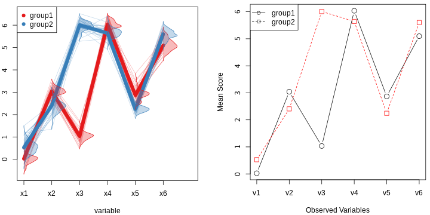
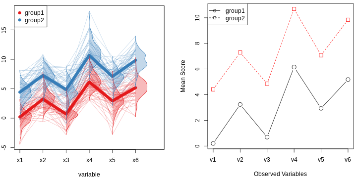
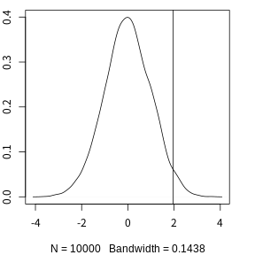
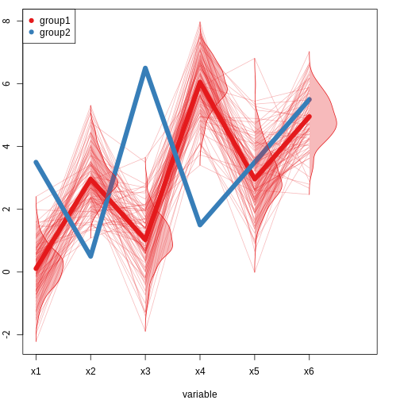

### Example 1


```r
summary(profile_result1)
```

```
## Call:
## profileR::pbg(data = profile_sample1_t[, 3:8], group = profile_sample1_t$group, 
##     profile.plot = T)
## 
## Hypothesis Tests:
## $`Ho: Profiles are parallel`
##   Multivariate.Test   Statistic Approx.F num.df den.df      p.value
## 1             Wilks  0.01052766 1015.069      5     54 4.458202e-52
## 2            Pillai  0.98947234 1015.069      5     54 4.458202e-52
## 3  Hotelling-Lawley 93.98788803 1015.069      5     54 4.458202e-52
## 4               Roy 93.98788803 1015.069      5     54 4.458202e-52
## 
## $`Ho: Profiles have equal levels`
##             Df Sum Sq Mean Sq F value Pr(>F)    
## group        1  7.809   7.809   688.2 <2e-16 ***
## Residuals   58  0.658   0.011                   
## ---
## Signif. codes:  0 '***' 0.001 '**' 0.01 '*' 0.05 '.' 0.1 ' ' 1
## 
## $`Ho: Profiles are flat`
##          F df1 df2      p-value
## 1 1566.844   5  54 4.024687e-57
```
<br>  
<br>  

### Example 2


```r
summary(profile_result2)
```

```
## Call:
## profileR::pbg(data = profile_sample2_t[, 3:8], group = profile_sample2_t$group, 
##     profile.plot = T)
## 
## Hypothesis Tests:
## $`Ho: Profiles are parallel`
##   Multivariate.Test  Statistic  Approx.F num.df den.df   p.value
## 1             Wilks 0.97623808 0.4575975      5     94 0.8068003
## 2            Pillai 0.02376192 0.4575975      5     94 0.8068003
## 3  Hotelling-Lawley 0.02434029 0.4575975      5     94 0.8068003
## 4               Roy 0.02434029 0.4575975      5     94 0.8068003
## 
## $`Ho: Profiles have equal levels`
##             Df Sum Sq Mean Sq F value Pr(>F)    
## group        1  461.1   461.1     649 <2e-16 ***
## Residuals   98   69.6     0.7                   
## ---
## Signif. codes:  0 '***' 0.001 '**' 0.01 '*' 0.05 '.' 0.1 ' ' 1
## 
## $`Ho: Profiles are flat`
##          F df1 df2      p-value
## 1 168.5427   5  94 2.545121e-45
```
<br>  
<br>  

### Example 3 : small sample
##### pvalue example

```r
par(mfrow = c(1,1), mar=c(4,2,0.8,2))
x <- rnorm(10000)
pvalue(x, 1.96, plot = T)
```



```
## [1] 0.02552841
```
<br>  



##### 1) level test

```r
round(p_level, 2)
```

```
##   x1   x2   x3   x4   x5   x6 
## 0.00 0.01 0.00 0.00 0.32 0.29
```
<br>  

##### 2) parallel test
$x_1 - x_2, x_2 - x_3, ..., x_{p-1} - x_p,\;p = the\,number\,of\,variables$


```r
round(p_parallel, 2)
```

```
## x1-x2 x2-x3 x3-x4 x4-x5 x5-x6 
##   0.0   0.0   0.0   0.0   0.5
```
